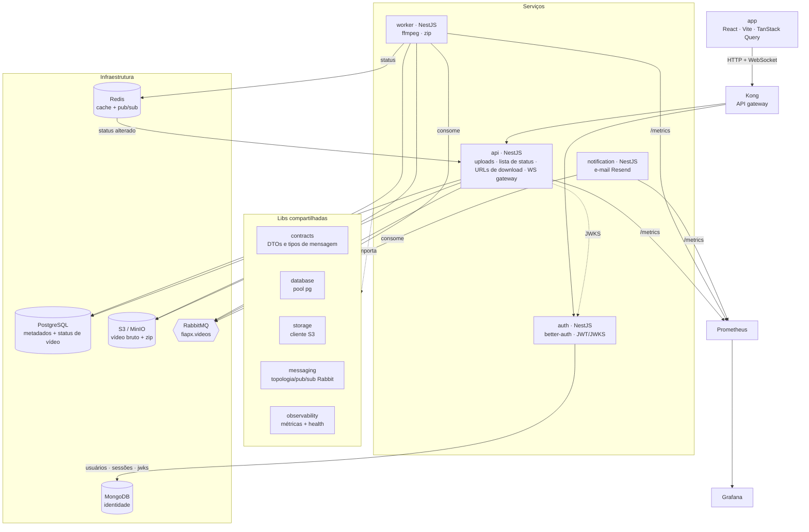
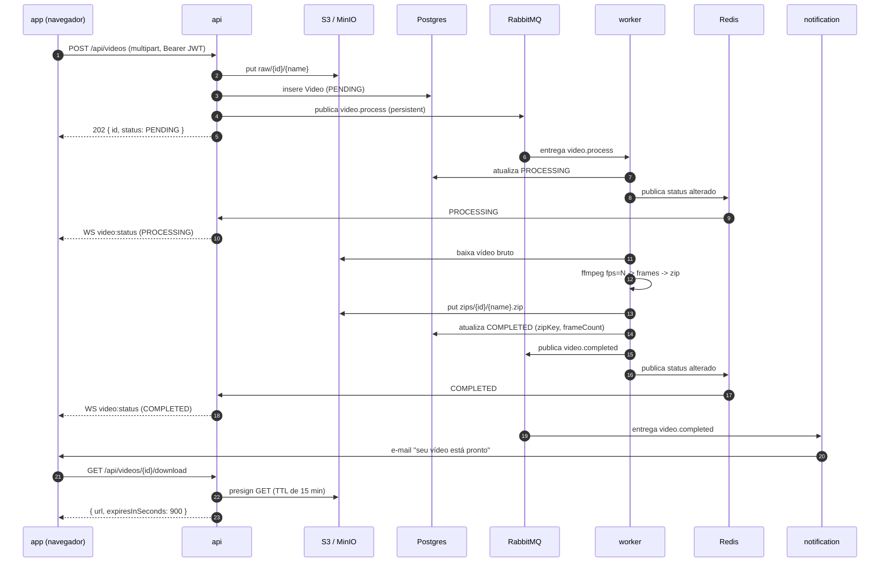
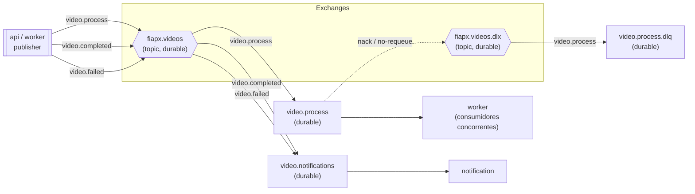

# Arquitetura

O FIAP X é um monorepo com cinco aplicações deployáveis e um conjunto de bibliotecas compartilhadas,
integradas em torno de um message broker durável. Este documento cobre o layout de componentes, o
fluxo de requisição de ponta a ponta, a topologia do RabbitMQ que garante a entrega e o raciocínio por
trás das principais escolhas de tecnologia.

> O repositório também traz o `arquitetura-v1.jpeg`, o esboço original feito à mão. O que segue é a v2
> corrigida que o código de fato implementa.

## Componentes

### Responsabilidades

| App | Runtime | Responsável por |
|---|---|---|
| **api** | NestJS (HTTP + Socket.IO) | Aceita uploads multipart (protegidos por JWT), guarda o arquivo bruto no S3, grava a linha `Video`, publica `video.process`, serve a lista de status paginada e as URLs de download pré-assinadas, hospeda o gateway WebSocket e expõe o Swagger em `/api/docs`. |
| **auth** | NestJS + better-auth | Contas com e-mail/senha, persistidas no **MongoDB** via o `mongodbAdapter` do better-auth. Emite **JWTs EdDSA** de curta duração (1h) com issuer/audience e um payload `{ email, name }`, e publica o **JWKS** contra o qual o `api` faz a verificação. |
| **worker** | NestJS (consumidor RabbitMQ) | Consumidor concorrente em `video.process`: baixa o vídeo do S3, extrai os frames com ffmpeg, compacta em zip, envia o ZIP, atualiza o status e publica `video.completed` / `video.failed`. Stateless — escale pelo número de réplicas. |
| **notification** | NestJS (consumidor RabbitMQ) | Consome `video.completed` / `video.failed` e envia e-mail ao usuário via Resend (dry-run quando `RESEND_API_KEY` está vazio). |
| **app** | React + Vite | SPA com tema spacetime: upload por drag-drop com progresso, lista de status ao vivo, downloads, alternância claro/escuro. |

As bibliotecas compartilhadas mantêm as preocupações transversais em um só lugar: **contracts** (os
DTOs HTTP e os formatos de mensagem RabbitMQ/Redis compartilhados por `api` e `worker`), **database**
(um provider de pool do Postgres), **storage** (o cliente S3 put/get/presign), **messaging** (assertion
de topologia, publisher, consumer) e **observability** (o registro do Prometheus, o `/metrics` e o
`/health`).

### Uma nota sobre o Kong e o setup local

O Kong é o gateway de borda pretendido: um único ponto de entrada que roteia para `api` e `auth`, e onde
rate-limiting/terminação TLS ficam em um ambiente deployado. Na stack local do Docker Compose o gateway
não é executado — o frontend acessa o `api` na `:3000` e o `auth` na `:3001` diretamente
(`VITE_API_URL` / `VITE_AUTH_URL`). A topologia dos serviços é idêntica de qualquer forma; o Kong apenas
colapsa as duas origens públicas em uma só em produção.

## Fluxo de requisição

Em caso de falha o worker segue o caminho simétrico: marca a linha como `FAILED`, publica `video.failed`
(que o serviço de notificação transforma em um e-mail de falha) e emite a mudança de status `FAILED`
para que a UI se atualize imediatamente. O diretório de trabalho temporário é sempre limpo em um bloco
`finally`, tenha o processamento tido sucesso ou lançado erro.

## Topologia do RabbitMQ

As garantias de entrega vivem no broker. A topologia é declarada (de forma idempotente) tanto pelo
publisher quanto por todo consumidor na inicialização, então qualquer serviço consegue fazer o bootstrap
do grafo de exchange/queue.

**Bindings**

| Exchange | Routing key | Queue |
|---|---|---|
| `fiapx.videos` | `video.process` | `video.process` |
| `fiapx.videos` | `video.completed` | `video.notifications` |
| `fiapx.videos` | `video.failed` | `video.notifications` |
| `fiapx.videos.dlx` | `video.process` | `video.process.dlq` |

A fila `video.process` é declarada com `deadLetterExchange: fiapx.videos.dlx`. Quando um consumidor dá
`nack` numa mensagem sem requeue (seu handler lançou erro), o broker a roteia para a DLX e ela cai em
`video.process.dlq` para inspeção ou replay — nunca entra em loop quente e nunca é descartada
silenciosamente.

**Como o "nenhuma requisição perdida" é de fato alcançado**

- **Exchanges e queues duráveis** sobrevivem a um restart do broker.
- **Mensagens persistentes** (`persistent: true`) são gravadas em disco, e o publisher usa um confirm
  channel, então um publish só resolve depois que o broker aceitou a mensagem.
- **Ack manual só no sucesso** — o consumidor dá ack *depois* que o handler resolve. Um crash no meio do
  job deixa a mensagem sem ack, então o RabbitMQ a reentrega a outro worker.
- **Prefetch** (`RABBITMQ_PREFETCH`, default 4) limita o trabalho em voo por consumidor, então uma
  rajada se enfileira em vez de sobrecarregar uma instância.
- **Dead-letter queue** captura mensagens envenenadas para que um único vídeo ruim não trave o pipeline.

## Status em tempo real

As mudanças de status trafegam pelo pub/sub do Redis, desacopladas do HTTP:

1. O `worker` publica um payload `VideoStatusChanged` no canal Redis `fiapx:video-status`.
2. O gateway WebSocket do `api` assina esse canal. Ao conectar, um cliente Socket.IO apresenta seu JWT
   (`io(url, { auth: { token } })`); o gateway o verifica e junta o socket a uma room nomeada pelo id do
   usuário.
3. Quando uma mensagem de status chega, o gateway emite `video:status` **apenas para a room daquele
   usuário**, então os usuários só veem os próprios vídeos.

O pub/sub do Redis (em vez de um push direto de socket a partir do worker) significa que a instância do
`api` que segura o WebSocket e a instância do `worker` que roda o job não precisam saber uma da outra, e
o tier do `api` pode ser escalado para muitas instâncias — cada uma assina o mesmo canal e faz o fan-out
para quaisquer clientes que ela por acaso esteja segurando.

## Escalabilidade e resiliência

- **Os workers escalam horizontalmente.** São consumidores concorrentes em uma única fila durável, então
  adicionar réplicas aumenta a vazão linearmente até você saturar CPU (ffmpeg) ou a banda do S3. Sem
  coordenação, sem sharding — o RabbitMQ faz o balanceamento de carga.
- **Serviços stateless.** `api`, `auth`, `worker` e `notification` não guardam estado local. Todo o
  estado vive no MongoDB (identidade), Postgres (metadados de vídeo), S3 (binários), RabbitMQ (jobs em
  voo) ou Redis (cache/pub-sub). É isso que os torna seguros para rodar atrás do Kong ou de um
  `Deployment` do Kubernetes com N réplicas.
- **Rajadas são absorvidas, não descartadas.** Uploads retornam `202` em milissegundos; o trabalho de
  fato estaciona na fila e é drenado no ritmo dos workers.
- **Falhas são contidas.** Mensagens envenenadas vão para dead-letter; o job de um worker que caiu é
  reentregue; o usuário é notificado por e-mail na falha.
- **Serviços de apoio são intercambiáveis.** Localmente, o S3 é o MinIO e tudo roda no Compose. Em um
  deploy na nuvem as mesmas interfaces apontam para um MongoDB gerenciado, um Postgres gerenciado,
  ElastiCache/Redis, Amazon MQ/RabbitMQ e S3 — sem mudança de código de aplicação, apenas de
  configuração.

## Escolhas de tecnologia

**RabbitMQ para a fila de jobs.** O requisito rígido é "nunca perder uma requisição sob pico". Isso é um
problema de mensageria, e o RabbitMQ nos entrega isso diretamente: filas duráveis, mensagens
persistentes, publisher confirms, acknowledgement manual, back-pressure baseado em prefetch e
dead-lettering — exatamente as primitivas que o enunciado pede. Consumidores concorrentes tornam o escalar
horizontal uma questão de número de réplicas.

**Redis para cache e pub/sub apenas — não para a fila.** O Redis é excelente para o fan-out de baixa
latência de eventos de status efêmeros ao tier WebSocket, e para cache. Ele deliberadamente *não* é o job
broker: listas simples do Redis não te dão as garantias de durabilidade, acking e dead-lettering que o
requisito de "nenhuma requisição perdida" exige. Usar cada ferramenta para o que ela faz de melhor mantém
as garantias honestas.

**S3 para binários, Postgres para metadados de vídeo.** Vídeos e ZIPs são grandes e opacos; eles
pertencem ao object storage, que é barato, durável e nos dá URLs pré-assinadas para que os downloads
nunca passem via proxy pela API. O Postgres guarda apenas as linhas que os descrevem — status, chaves,
contagem de frames, timestamps — o que mantém o banco pequeno e rápido e seus índices significativos. A
API entrega um `GET` pré-assinado (TTL de 15 minutos) em vez de fazer streaming dos bytes ela mesma.

**MongoDB para identidade — persistência poliglota.** O bounded context `auth` possui seu próprio store:
o better-auth persiste usuários, sessões, contas, verificações e JWKS através do seu `mongodbAdapter`
contra o banco `fiapx_auth`. O MongoDB é schemaless, então a identidade não precisa de migração SQL — o
better-auth cria suas coleções no primeiro uso. Manter a identidade fora do Postgres de processamento de
vídeo nos dá **banco por (bounded) context**: **MongoDB** (identidade) + **PostgreSQL** (metadados de
vídeo) + **Redis** (cache/realtime) + **S3** (binários), cada store escolhido pelo formato do dado que
guarda em vez de forçado em um único engine.

**NestJS + DDD por serviço.** Um modelo consistente de módulo/provider em todos os quatro apps de
backend, com uma separação limpa `domain → application → infrastructure → interface` para que a lógica de
negócio fique livre de preocupações de I/O e as fronteiras sejam reforçáveis pelas regras de
module-boundary do Nx.

**Monorepo Nx + pnpm.** Os contracts compartilhados (DTOs de mensagem e HTTP) vivem em um só lugar e são
importados tanto pelo produtor quanto pelo consumidor, então o formato de fio não pode divergir. O grafo
de afetados do Nx faz o CI buildar e testar apenas o que mudou.
