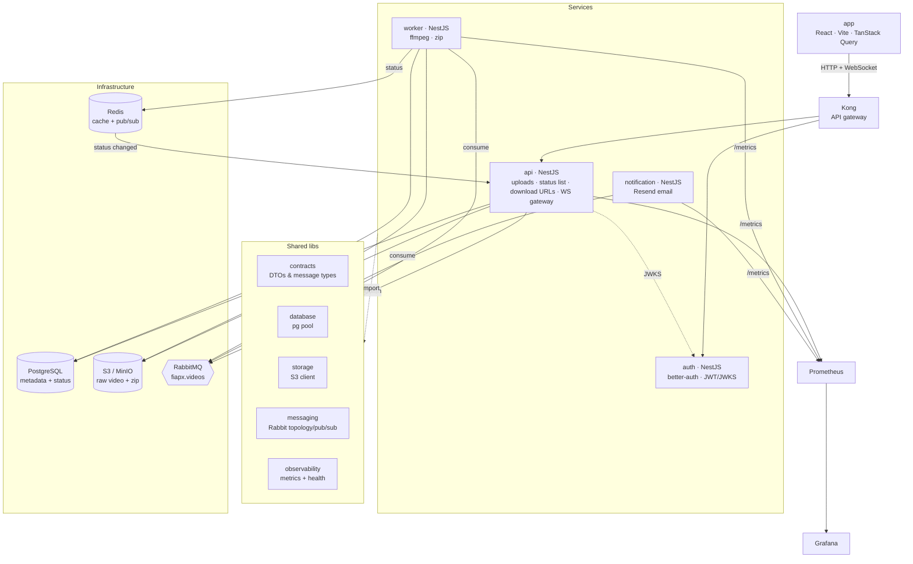
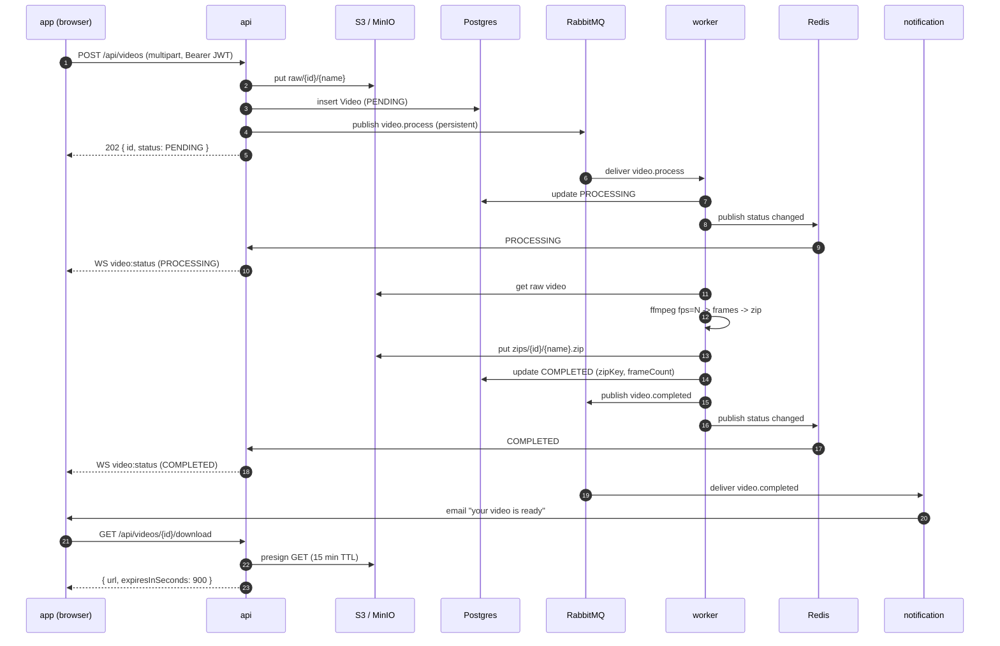
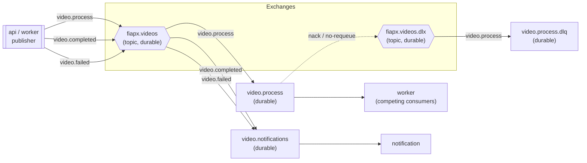

# Architecture

FIAP X is a monorepo of five deployable applications and a set of shared libraries, wired together
around a durable message broker. This document covers the component layout, the end-to-end request
flow, the RabbitMQ topology that guarantees delivery, and the reasoning behind the main technology
choices.

> The repository also carries `arquitetura-v1.jpeg`, the original hand-drawn sketch. What follows is
> the corrected v2 that the code actually implements.

## Components

### Responsibilities

| App | Runtime | Owns |
|---|---|---|
| **api** | NestJS (HTTP + Socket.IO) | Accepts multipart uploads (JWT-protected), stores the raw file in S3, writes the `Video` row, publishes `video.process`, serves the paginated status list and presigned download URLs, hosts the WebSocket gateway, and exposes Swagger at `/api/docs`. |
| **auth** | NestJS + better-auth | Email/password accounts. Issues short-lived **EdDSA JWTs** (1h) with an issuer/audience and a `{ email, name }` payload, and publishes the **JWKS** the `api` verifies against. |
| **worker** | NestJS (RabbitMQ consumer) | Competing consumer on `video.process`: pulls the video from S3, extracts frames with ffmpeg, zips them, uploads the ZIP, updates status, and publishes `video.completed` / `video.failed`. Stateless — scale by replica count. |
| **notification** | NestJS (RabbitMQ consumer) | Consumes `video.completed` / `video.failed` and emails the user via Resend (dry-run when `RESEND_API_KEY` is empty). |
| **app** | React + Vite | Spacetime-themed SPA: drag-drop upload with progress, live status list, downloads, dark/light toggle. |

Shared libraries keep cross-cutting concerns in one place: **contracts** (the HTTP DTOs and the
RabbitMQ/Redis message shapes shared by `api` and `worker`), **database** (a Postgres pool provider),
**storage** (the S3 put/get/presign client), **messaging** (topology assertion, publisher, consumer),
and **observability** (the Prometheus registry, `/metrics`, and `/health`).

### A note on Kong and the local setup

Kong is the intended edge gateway: a single entry point that routes to `api` and `auth`, and where
rate-limiting/TLS termination live in a deployed environment. In the local Docker Compose stack the
gateway is not run — the frontend reaches `api` on `:3000` and `auth` on `:3001` directly
(`VITE_API_URL` / `VITE_AUTH_URL`). The service topology is identical either way; Kong simply
collapses the two public origins into one in production.

## Request flow

On failure the worker takes the symmetric path: it marks the row `FAILED`, publishes `video.failed`
(which the notification service turns into a failure email), and emits the `FAILED` status change so
the UI updates immediately. The temporary working directory is always cleaned up in a `finally`
block, whether processing succeeded or threw.

## RabbitMQ topology

Delivery guarantees live in the broker. The topology is asserted (idempotently) by both the
publisher and every consumer on startup, so any service can bootstrap the exchange/queue graph.

**Bindings**

| Exchange | Routing key | Queue |
|---|---|---|
| `fiapx.videos` | `video.process` | `video.process` |
| `fiapx.videos` | `video.completed` | `video.notifications` |
| `fiapx.videos` | `video.failed` | `video.notifications` |
| `fiapx.videos.dlx` | `video.process` | `video.process.dlq` |

The `video.process` queue is declared with `deadLetterExchange: fiapx.videos.dlx`. When a consumer
`nack`s a message without requeue (its handler threw), the broker routes it to the DLX and it lands
in `video.process.dlq` for inspection or replay — it never hot-loops and it is never silently
dropped.

**How "no request lost" is actually achieved**

- **Durable exchanges and queues** survive a broker restart.
- **Persistent messages** (`persistent: true`) are written to disk, and the publisher uses a confirm
  channel so a publish only resolves once the broker has accepted the message.
- **Manual ack on success only** — the consumer acks *after* the handler resolves. A crash mid-job
  leaves the message unacked, so RabbitMQ redelivers it to another worker.
- **Prefetch** (`RABBITMQ_PREFETCH`, default 4) bounds in-flight work per consumer so a burst queues
  up instead of overwhelming a box.
- **Dead-letter queue** catches poison messages so one bad video can't wedge the pipeline.

## Real-time status

Status changes travel over Redis pub/sub, decoupled from HTTP:

1. The `worker` publishes a `VideoStatusChanged` payload to the Redis channel `fiapx:video-status`.
2. The `api` WebSocket gateway subscribes to that channel. On connect, a Socket.IO client presents
   its JWT (`io(url, { auth: { token } })`); the gateway verifies it and joins the socket to a room
   named after the user id.
3. When a status message arrives, the gateway emits `video:status` **only to that user's room**, so
   users only ever see their own videos.

Redis pub/sub (rather than a direct socket push from the worker) means the WebSocket-holding `api`
instance and the job-running `worker` instance don't need to know about each other, and the `api`
tier can be scaled to many instances — each subscribes to the same channel and fans out to whichever
clients it happens to hold.

## Scaling & resilience

- **Workers scale horizontally.** They are competing consumers on one durable queue, so adding
  replicas increases throughput linearly until you saturate CPU (ffmpeg) or S3 bandwidth. No
  coordination, no sharding — RabbitMQ does the load balancing.
- **Stateless services.** `api`, `auth`, `worker`, and `notification` keep no local state. All state
  lives in Postgres (metadata), S3 (binaries), RabbitMQ (in-flight jobs), or Redis (cache/pub-sub).
  That's what makes them safe to run behind Kong or a Kubernetes `Deployment` with N replicas.
- **Bursts are absorbed, not dropped.** Uploads return `202` in milliseconds; the actual work parks
  in the queue and drains at the workers' pace.
- **Failures are contained.** Poison messages dead-letter; a crashed worker's job is redelivered;
  the user is emailed on failure.
- **Backing services are swappable.** Locally, S3 is MinIO and everything runs in Compose. In a
  cloud deployment the same interfaces point at managed Postgres, ElastiCache/Redis, Amazon MQ/
  RabbitMQ, and S3 — no application code changes, only configuration.

## Technology choices

**RabbitMQ for the job queue.** The hard requirement is "never lose a request under peak." That is a
messaging problem, and RabbitMQ gives it to us directly: durable queues, persistent messages,
publisher confirms, manual acknowledgement, prefetch-based back-pressure, and dead-lettering — the
exact primitives the brief asks for. Competing consumers make horizontal scaling a matter of replica
count.

**Redis for cache and pub/sub only — not the queue.** Redis is excellent for low-latency fan-out of
ephemeral status events to the WebSocket tier, and for caching. It is deliberately *not* the job
broker: plain Redis lists don't give you the durability, acking, and dead-lettering guarantees that
the "no lost request" requirement demands. Using each tool for what it's best at keeps the guarantees
honest.

**S3 for binaries, Postgres for metadata.** Videos and ZIPs are large and opaque; they belong in
object storage, which is cheap, durable, and gives us presigned URLs so downloads never proxy through
the API. Postgres holds only the rows that describe them — status, keys, frame counts, timestamps —
which keeps the database small and fast and its indexes meaningful. The API hands out a presigned
`GET` (15-minute TTL) instead of streaming bytes itself.

**NestJS + DDD per service.** A consistent module/provider model across all four backend apps, with a
clean `domain → application → infrastructure → interface` split so business logic stays free of I/O
concerns and the boundaries are enforceable by the Nx module-boundary rules.

**Nx + pnpm monorepo.** Shared contracts (message and HTTP DTOs) live in one place and are imported
by both producer and consumer, so the wire format can't drift. Nx's affected-graph means CI only
builds and tests what changed.
